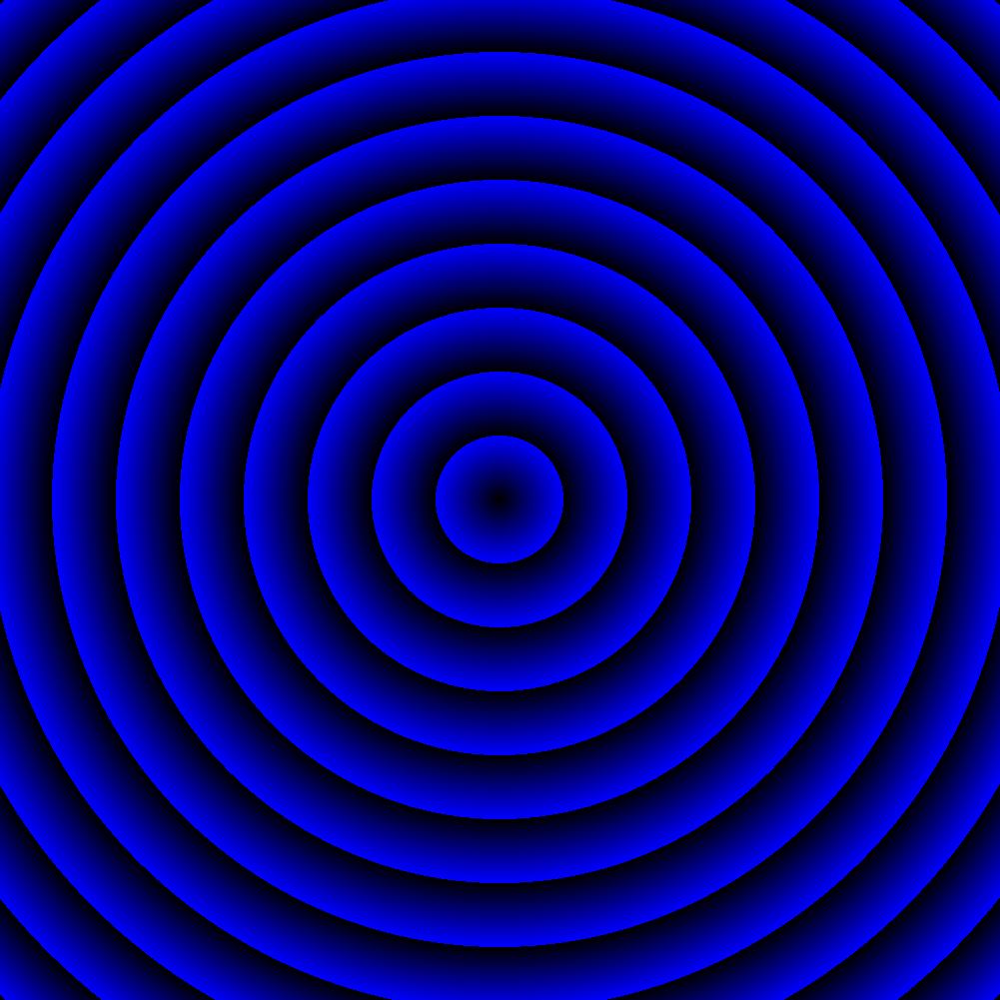

# heatimg

heatimg generates heatmap images from heatmap json.  
heatmap json's format like below:

```
{
  "gridLevel": 5,
  "columns": 23,
  "rows": 17,
  "minX": 139.1748046875,
  "maxX": 140.185546875,
  "minY": 35.33203125,
  "maxY": 36.0791015625,
  "counts_ints2D": [[...], [...]]
}
```

```
heatimg -input heatmap.json -output circle.png
```



# License

MIT License

Copyright (c) 2021 Taisuke Miyazaki


